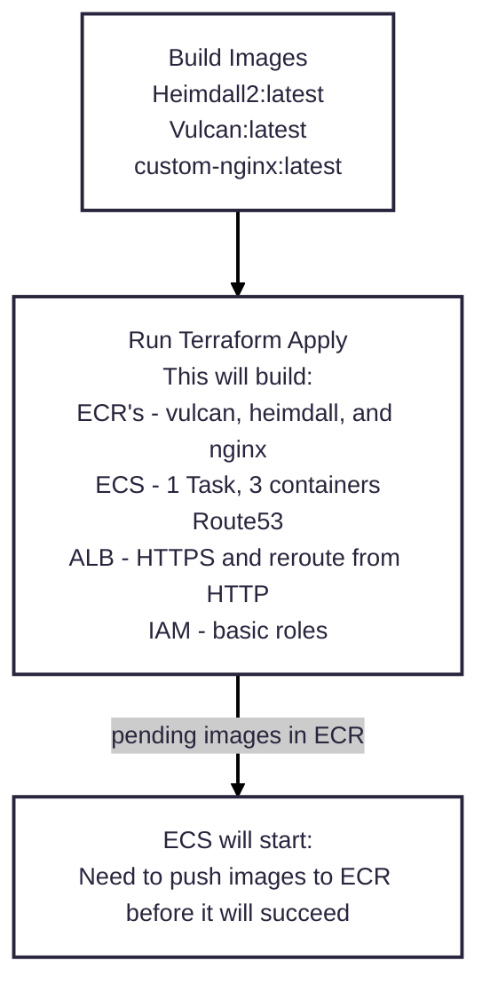
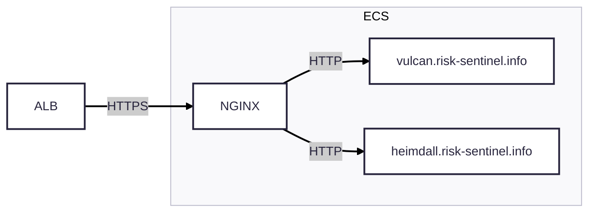

# Sandbox

## Purpose

The Sandbox is exactly as it sounds. It is a repo for testing services and development storage.

<strong>Important: Do not rely on this repo to be stable as code is moved in and out of it.</strong>

## Outstanding work before functional

- [ ] RDS to attach Vulcan and Heimdall
- [ ] Environment variables for Heimdall
- [ ] Environment variables for Vulcan
- [ ] Validate NGINX has HTTPS and Reverse Proxy

## Desired Function

