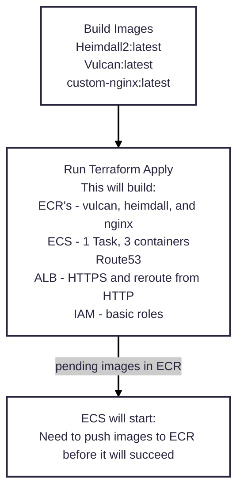
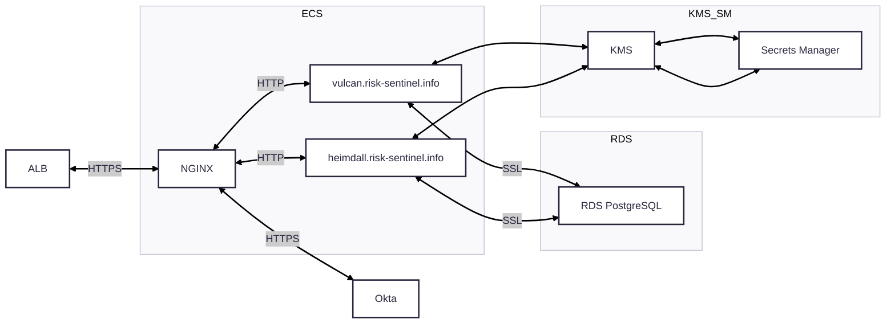

# Sandbox

## Purpose

The Sandbox is exactly as it sounds. It is a repo for testing services and development storage.

<strong>Important: Do not rely on this repo to be stable as code is moved in and out of it.</strong>

## Work to make it functional

- [x] Create the ECR
- [x] Re-tag images
- [x] Route53 Transfer of risk-sentinel - in-progress
- [ ] Update ECS permissions for retrieving the images
- [x] RDS to attach Vulcan and Heimdall
- [x] Environment variables for Heimdall
- [x] Environment variables for Vulcan
- [ ] Validate NGINX has HTTPS and Reverse Proxy

## Desired Function

